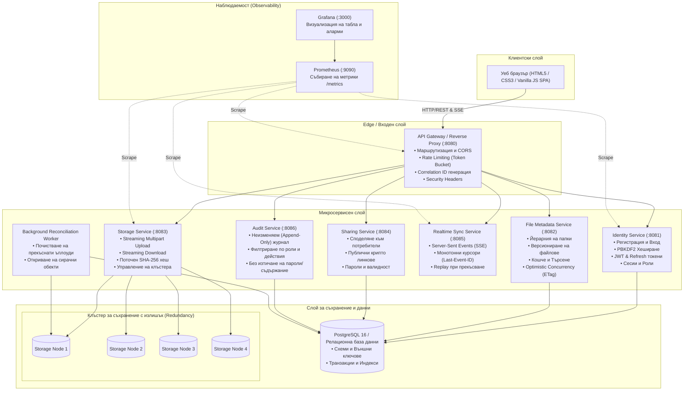
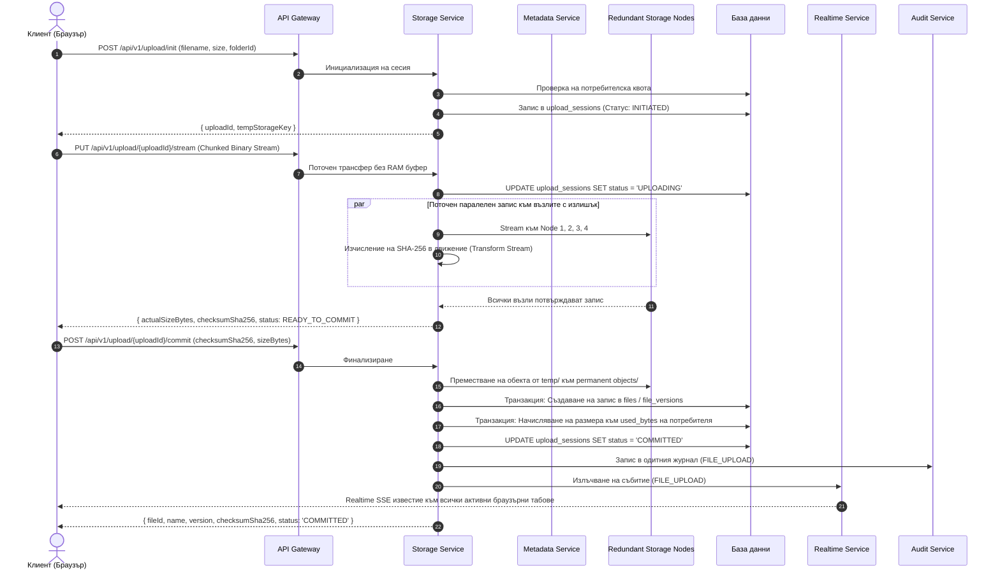
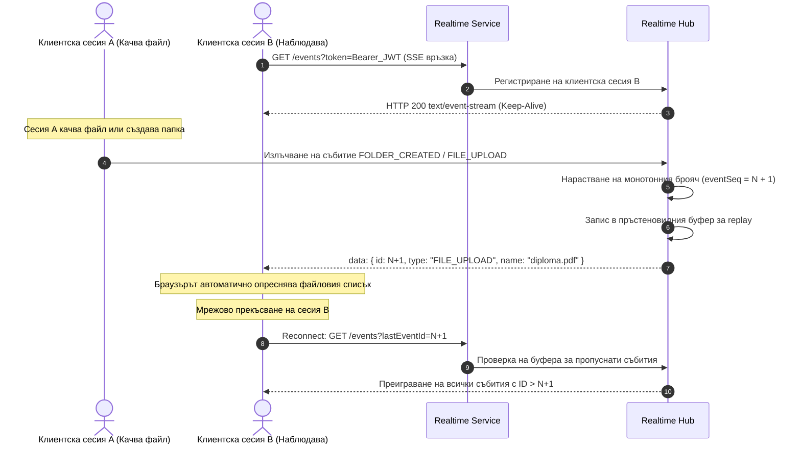
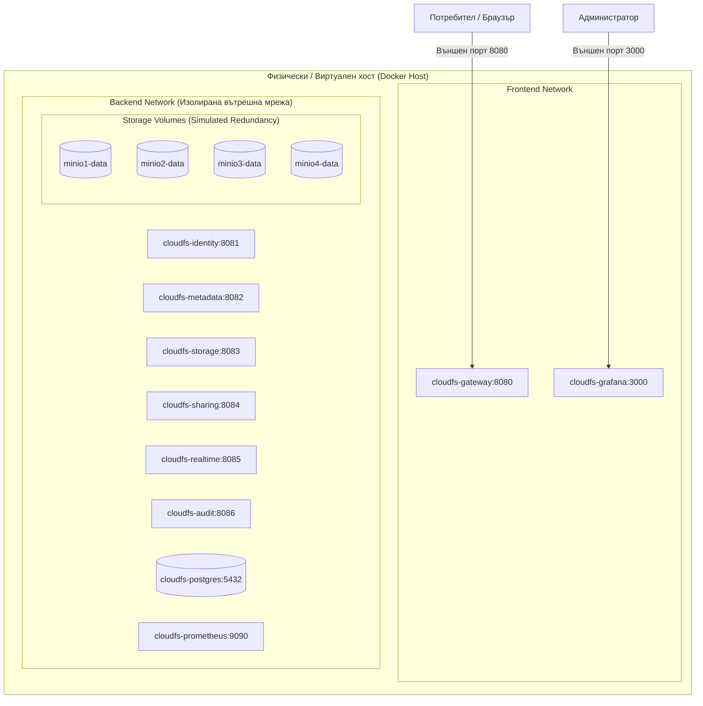

# Архитектура на софтуерната система

**Дипломен проект:** „Облачна информационна система за съхранение и управление на файлове с микросервисна архитектура“  
**Автор:** Дипломант ТУ - София, специалност „Компютърни системи и технологии“

---

## 1. Компонентна архитектура (Component / Container View)

Системата е структурирана като набор от слабо свързани микросервиси, оркестрирани зад единен API Gateway / Edge Service.

---

## 2. Последователност при поточно качване (Upload Lifecycle Sequence)

Жизненият цикъл на качване гарантира, че прекъснати или недовършени мрежови трансфери никога не оставят валиден файлов запис без физически обект.

---

## 3. Синхронизация в реално време (Realtime Synchronization Sequence)

---

## 4. Архитектура на разгръщане (Deployment View)

