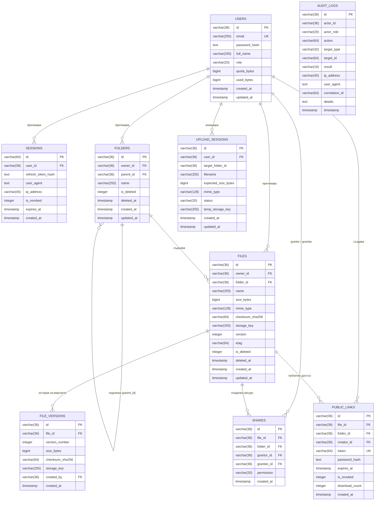

# Модел на данните (Data Model & Invariants)

**Дипломен проект:** „Облачна информационна система за съхранение и управление на файлове с микросервисна архитектура“  
**Специалност:** „Компютърни системи и технологии“, ТУ - София

---

## 1. Диаграма на релациите (Entity-Relationship Diagram)

---

## 2. Системни инварианти и ограничения за цялостност

1. **Инвариант на дисковата квота:**  
   $$used\_bytes = \sum_{f \in ActiveFiles} f.size\_bytes + \sum_{v \in ActiveVersions} v.size\_bytes$$  
   Системата никога не позволява $used\_bytes > quota\_bytes$ при иницииране на качване.

2. **Оптимистичен контрол на конкурентността (Optimistic Concurrency Control):**  
   Всяка промяна във файл (преименуване, преместване, нова версия) се валидира чрез хедъра `If-Match: "<ETag>"`. Ако клиент изпрати остарял ETag, операцията се отхвърля с HTTP код `412 Precondition Failed`.

3. **Неизменяемост на одитния журнал (Append-Only Invariant):**  
   Таблицата `audit_logs` не поддържа операции `UPDATE` или `DELETE`. Записват се само успешни или неуспешни събития с метаданни, лишавани от тайни (пароли, токени и cookies).

4. **Жизнен цикъл на сесиите за качване (Upload Lifecycle FSM):**  
   Преходите между състоянията са строго дефинирани:  
   $$\text{INITIATED} \longrightarrow \text{UPLOADING} \longrightarrow \text{COMMITTED} \quad \text{или} \quad \text{ABORTED}$$  
   Прекъснати сесии никога не се превръщат в активни файлове без завършена стъпка `commit`.
